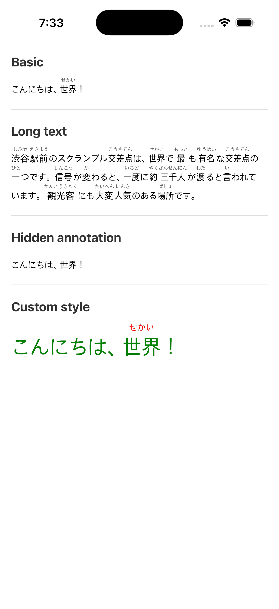

# react-native-ruby-text

A React Native component for rendering Japanese furigana (ruby) text.

HTML has the [`<ruby>`](https://developer.mozilla.org/en-US/docs/Web/HTML/Element/ruby) element, but React Native has no built-in equivalent. This library fills that gap for screens that need to render furigana above kanji (漢字) — such as Japanese learning apps or manga readers.



## Installation

```bash
npm install react-native-ruby-text
# or
yarn add react-native-ruby-text
```

## Usage

```tsx
import { Ruby } from 'react-native-ruby-text';

export function Example() {
  return (
    <Ruby
      data={[
        { base: 'こんにちは' },
        { base: '、' },
        { base: '世界', annotation: 'せかい' },
        { base: '！' },
      ]}
    />
  );
}
```

### Props

| Prop               | Type                                           | Default | Description                                                 |
| ------------------ | ---------------------------------------------- | ------- | ----------------------------------------------------------- |
| `data`             | `Array<{ base: string; annotation?: string }>` | —       | Base text and the annotation (furigana) to display above it |
| `annotationHidden` | `boolean`                                      | `false` | Whether to hide the annotation                              |
| `baseStyle`        | `TextStyle`                                    | —       | Style applied to the base text                              |
| `annotationStyle`  | `TextStyle`                                    | —       | Style applied to the annotation text                        |
| `style`            | `ViewStyle`                                    | —       | Style applied to the outer container                        |

## Development

This project uses [Yarn](https://yarnpkg.com/) workspaces. The example app lives in the `example` directory.

Install dependencies from the repository root:

```bash
yarn install
```

Run the example app:

```bash
yarn example ios      # iOS simulator
yarn example android  # Android emulator
yarn example web      # web browser
```

## License

[MIT](LICENSE) © Siby1lA
